---

## Scenario

**Company:** BestRun

**Challenge:** The company BestRun wants to optimize their procurement process by establishing a Risk Assessment Process using an AI Agent.

**Data Sources:**
| Source | Content |
|---|---|
| Business Partner API | Supplier details |
| Risk Analytics API | Third party API (e.g. Everstream system) that exposes risk associated with a location |
| Plant API | Plant details |
| Material API | Material, Storage location, stock levels, and batch details |


> [!NOTE]
> All these APIs are mock APIs publicly hosted for trial. They can be used to create a composed API via Business Data Graph, as detailed in this exercise.

**Goal:** Select most reliable supplier for each material taking into consideration the risk associated with a location of the plant, stock levels of the material at a plant and physical distance of the plant from delivery location.

---


---
# Build a Supply Risk API with API Composition

<!-- description --> Use API Composition in SAP Integration Suite to compose supplier, plant, stock, and risk data from four APIs into a single unified Business Data Graph.

## Prerequisites

- An SAP BTP subaccount in the Cloud Foundry environment with Cloud Foundry enabled 
- **SAP Integration Suite** entitled, subscribed, and the `Integration_Provisioner` role collection assigned to your user
- **Cloud Integration** and **API Management including API Composition** activated on the SAP Integration Suite home page
- Ensure **Integration Cell** runtime is activated
- [Assign roles to your user for Cloud Integration and API Management Capabilities](https://help.sap.com/docs/integration-suite/sap-integration-suite/configuring-user-access?locale=en-US&state=PRODUCTION&version=CLOUD#loio2c6214a3228e4b4cba207f49fda92ed4__section_xbf_glz_l2c)
- [Setup API Composition Navigator Try Out Connectivity](https://help.sap.com/docs/api-composition/isuite-api-composition/api-composition-navigator-on-developer-hub?locale=en-US&q=API+COmposition+bavigator#setting-up-api-composition-navigator-tryout-connectivity)
  
If you don't have an SAP Integration Suite tenant yet, the quickest path is a free SAP BTP Trial account:

- [Check BTP regions where the API Composition capability is available](https://me.sap.com/notes/3338820)
- [Check BTP regions where the Integration Cell runtime is available](https://me.sap.com/notes/3769634)
- [Create an SAP BTP Trial Account on US East(VA)-AWS](https://developers.sap.com/tutorials/hcp-create-trial-account.html)
- [Set up SAP Integration Suite on Trial on US East(VA)-AWS](https://developers.sap.com/tutorials/cp-starter-isuite-onboard-subscribe.html)
- [Activate API Composition on SAP Integration Suite](https://help.sap.com/docs/api-composition/isuite-api-composition/initial-setup?locale=en-US#2.-activate-api-composition-on-sap-integration-suite)
- [Assign roles to your user for Cloud Integration and API Management Capabilities](https://help.sap.com/docs/integration-suite/sap-integration-suite/configuring-user-access?locale=en-US&state=PRODUCTION&version=CLOUD#loio2c6214a3228e4b4cba207f49fda92ed4__section_xbf_glz_l2c)
- [Setup API Composition Navigator Try Out Connectivity](https://help.sap.com/docs/api-composition/isuite-api-composition/api-composition-navigator-on-developer-hub?locale=en-US&q=API+COmposition+bavigator#setting-up-api-composition-navigator-tryout-connectivity)

Refer to the [API Composition Initial Setup](https://help.sap.com/docs/api-composition/isuite-api-composition/initial-setup) guide for full details.

## You will learn

- How to create a Business Data Graph composing four backend APIs into a single unified OData endpoint
- How to create a Model Extension and define a Custom Entity that joins data from multiple sources
- How to activate the Business Data Graph and retrieve the OData URL and OpenAPI Specification
- How to explore and test composed API using the API Composition Navigator

---

### Step 1 — Set Up the Four Destinations

Before creating the Business Data Graph, configure four HTTP destinations in your SAP BTP subaccount. Each destination points to one of the publicly hosted mock APIs as mentioned below:

| Destination | Path | Represents |
| :--- | :--- | :--- |
| `LocationRisk` | `https://api-composition-plant-material-risk.cfapps.eu20-002.hana.ondemand.com/location-risk/` | Location risk data (Everstream mock) |
| `S4_API_MATERIAL_STOCK_SRV` | `https://api-composition-plant-material-risk.cfapps.eu20-002.hana.ondemand.com/material-stock/` | Material stock levels (S/4HANA mock) |
| `S4_sap-s4-ce-plant-0001-v1` | `https://api-composition-plant-material-risk.cfapps.eu20-002.hana.ondemand.com/plant/` | Plant details (S/4HANA mock) |
| `s4hana_api_business-partner` | `https://api-composition-plant-material-risk.cfapps.eu20-002.hana.ondemand.com/business-partner/` | Supplier / Business Partner data |

Repeat the steps below for each destination.

From SAP Integration Suite, click the **grid icon (⠿)** in the top-right navigation bar and select **SAP BTP Cockpit**.

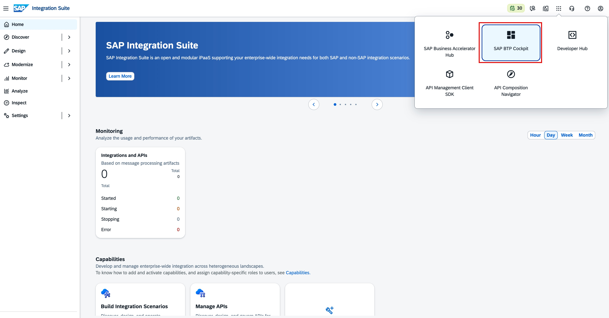

In the BTP Cockpit, go to your subaccount. In the left sidebar, navigate to **Connectivity → Destinations** and click **Create**.

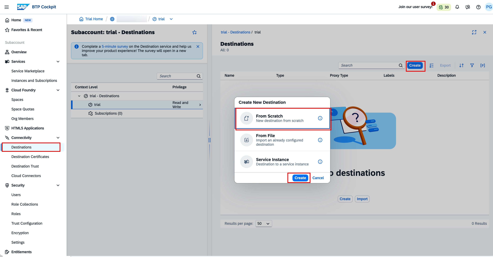

Fill in the following fields, then click **Save**.

| Field | Value |
| :--- | :--- |
| Name | *(destination name from the table above, e.g. **`LocationRisk`**)* |
| Type | **`HTTP`** |
| Proxy Type | **`Internet`** |
| URL | *(URL from the table above, e.g. **`https://api-composition-plant-material-risk.cfapps.eu20-002.hana.ondemand.com/location-risk/`**)* |
| Authentication | **`NoAuthentication`** |

Under **Additional Properties**, add:

| Key | Value |
| :--- | :--- |
| `IntegrationCell.Include` | **`true`** |

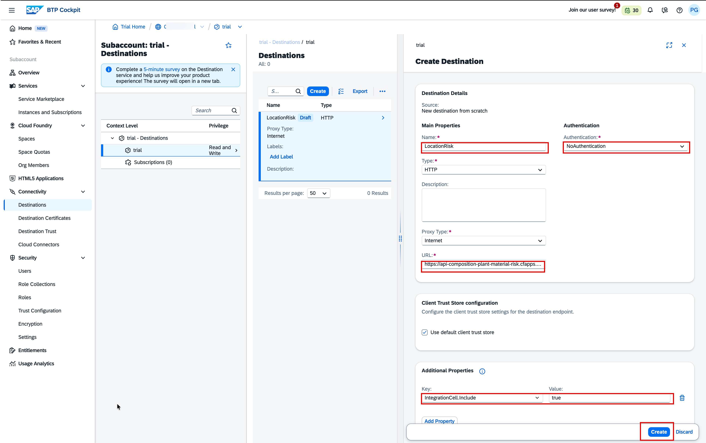

> The `IntegrationCell.Include = true` additional property is required to make the destination visible in the Integration Cell runtime. Without it, the destination will not appear when selecting data sources for a Business Data Graph.

---

### Step 2 — Create a New Business Data Graph

In SAP Integration Suite, go to **Design → Business Data Graphs**.

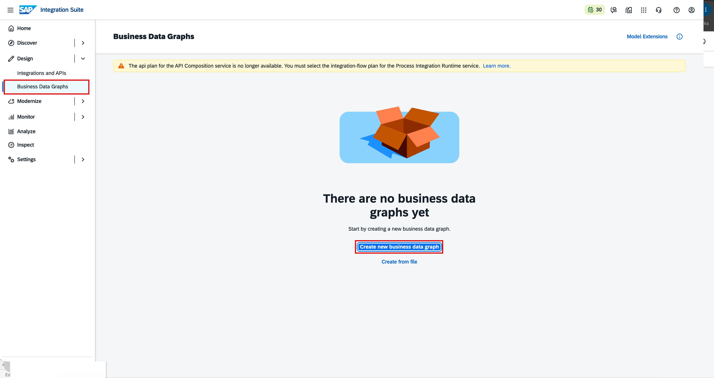

Click **Create → New business data graph**.

Fill in the details in the creation dialog:

| Field | Value |
| :--- | :--- |
| ID | **`plantsupplyrisk`** |
| Description | **`A unified API to identify risk associated with vendor location and stock level of a material in a plant.`** |

Under **Data Source Destinations**, select all four destinations:

- `LocationRisk`
- `S4_API_MATERIAL_STOCK_SRV`
- `S4_sap-s4-ce-plant-0001-v1`
- `s4hana_api_business-partner`

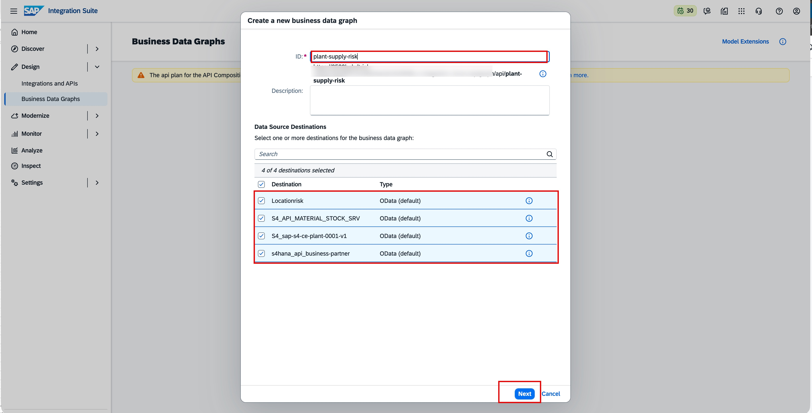

Click **Next**.

---

### Step 3 — Configure, Analyze and Review

On the **Model Extension** screen, leave **Model Extension** as *Select a Model Extension* (you will link it in Step 7), and keep **Enable OData Containment** checked.

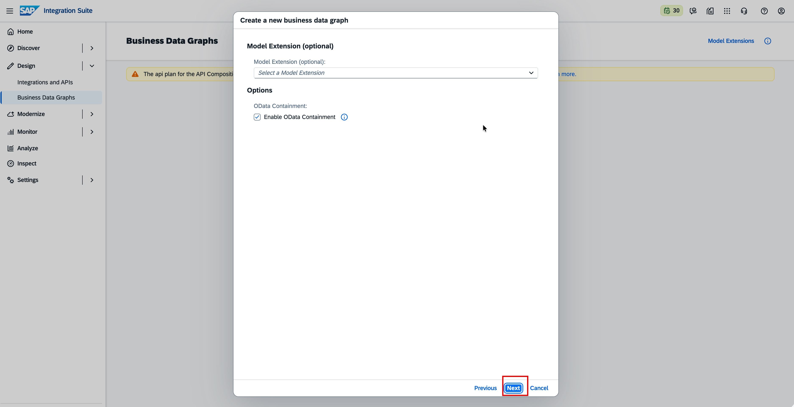

Click **Next**.

SAP Integration Suite will connect to each destination and analyze the data landscape. Wait until all destinations show a green **Success** status.

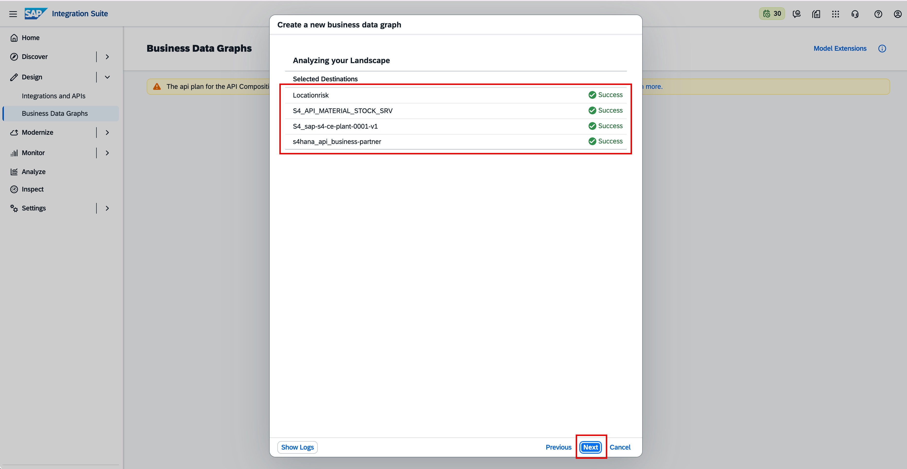

Click **Next**, then click **Done**.

You will land on the **Overview** page of your Business Data Graph in **Draft** status.

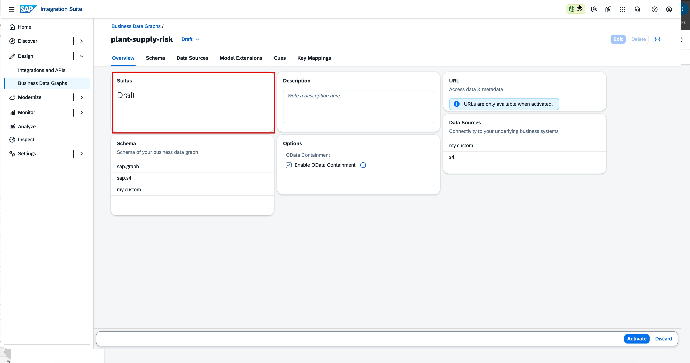

> The `bestrun` namespace will appear in the Schema after you link the Model Extension and re-activate the Business Data Graph in Step 7.

---

### Step 4 — Activate the Business Data Graph

Click **Activate** at the bottom of the page.
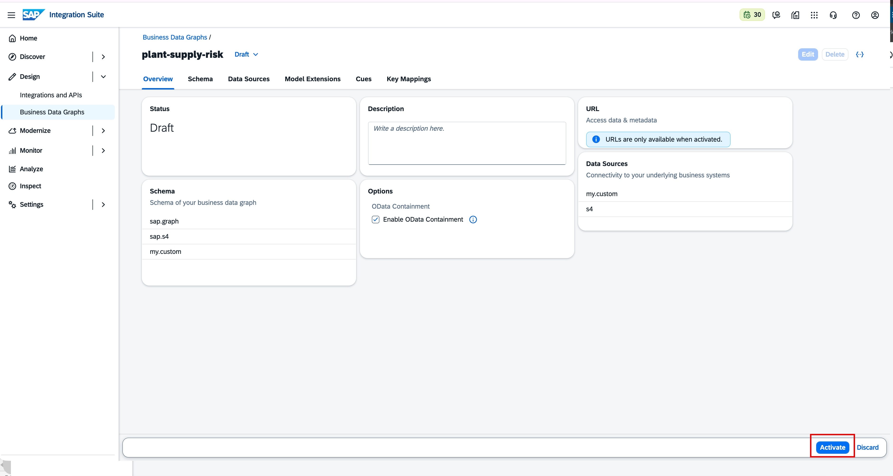

The status changes to **Available** and the Overview page shows the generated URLs.

| URL Type | Use |
| :--- | :--- |
| **OData** | Primary endpoint for data access |
| **GraphQL** | For GraphQL-based consumers |
| **Catalog** | Metadata discovery |

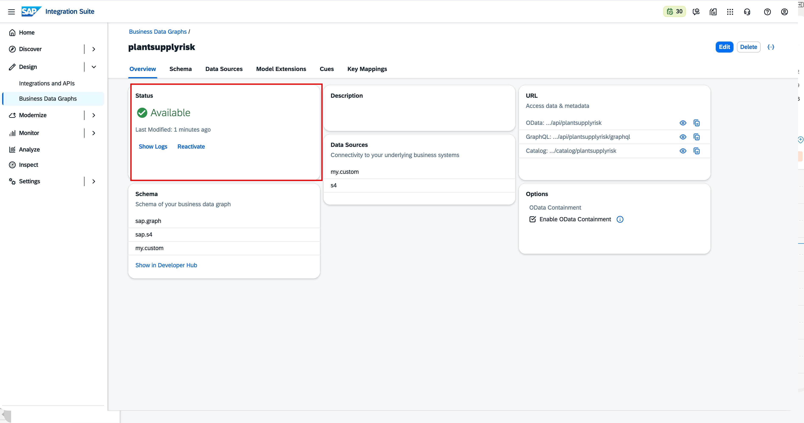

> You will copy the final OData URL after re-activating the Business Data Graph with the Model Extension in Step 7. That is the URL to use in your MCP Server configuration.

---

### Step 5 — Create a Model Extension

A **Model Extension** allows you to extend or customize the schema of your Business Data Graph.

From the **Business Data Graphs** page, click **Model Extensions** (top-right).

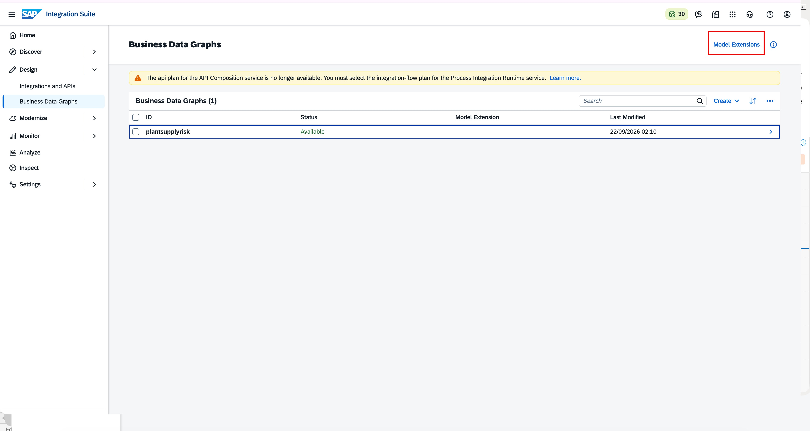

Click **Create → New Model Extension** 
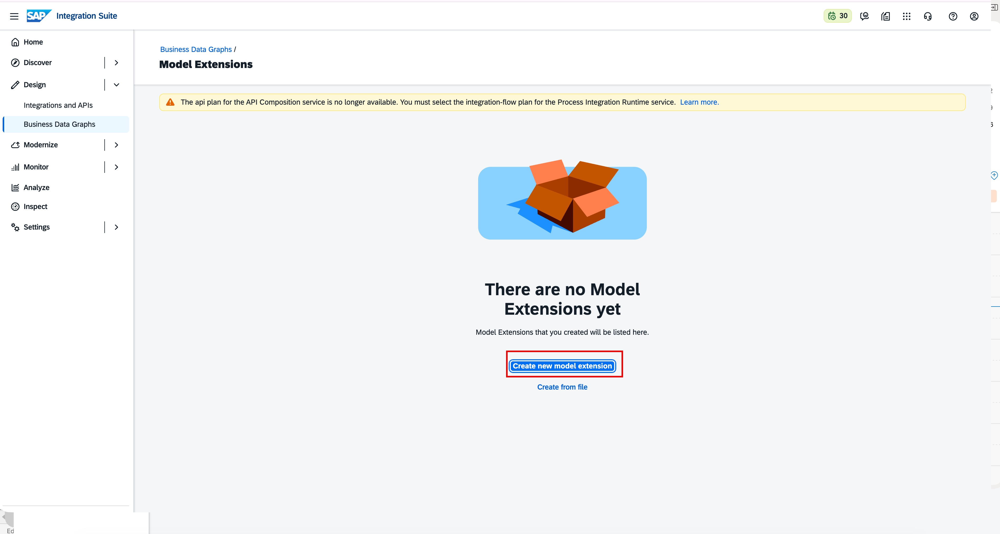

fill in the details:

| Field | Value |
| :--- | :--- |
| Name | **`plantsupplyrisk-extension`** |
| Description | **`A unified Model to identify the risk associated with vendor location and stock level of a material in a plant.`** |
| Use metadata from business data graph | Select **`plantsupplyrisk`** |
Click **Create**.

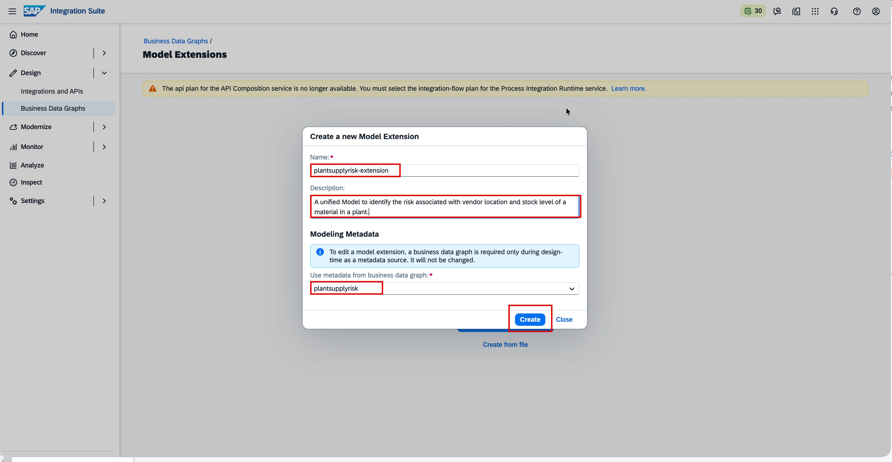


---

### Step 6 — Create a Custom Entity

From the Model Extension detail page, click the **Custom Entities** tab. Click **Create a custom entity**.

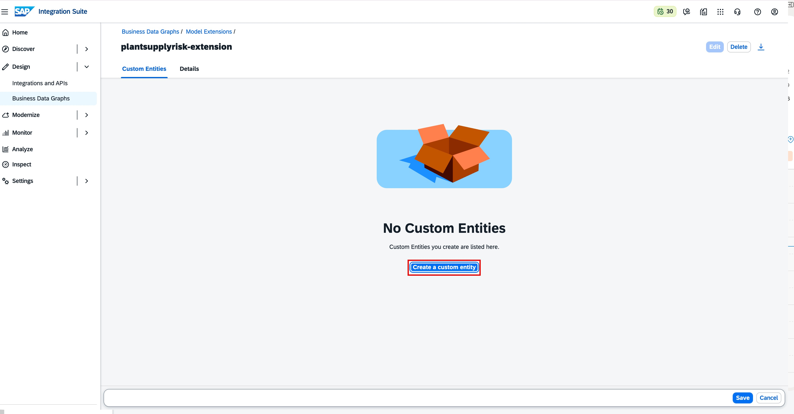

#### Name

Fill in the details:

| Field | Value |
| :--- | :--- |
| Name | **`bestrun.assessment`** |
| Label | *(leave empty)* |
| Description | **`this custom entity defines the relationship between our backend APIs`** |
| Read-only Custom Entity | *(unchecked)* |


Click **Next**.

#### Source Entities

Set the **Main Source Entity** to **`my.custom.Plant`**.

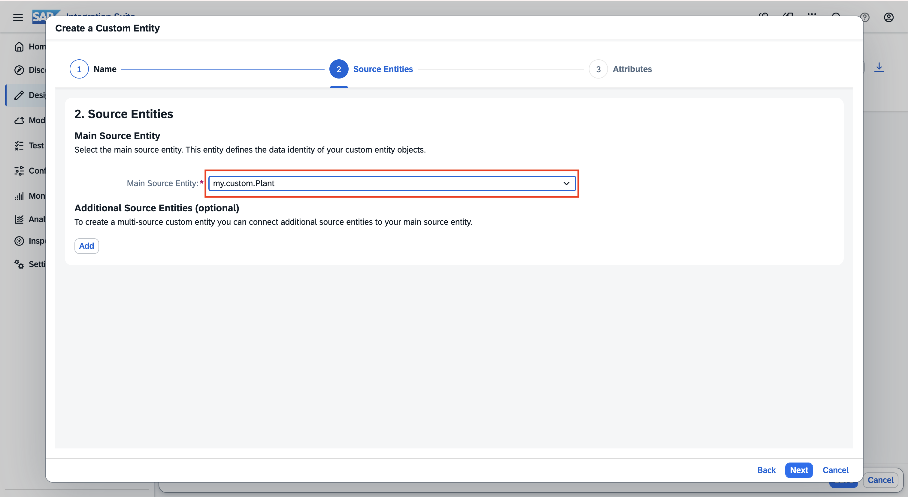

Click **Add** under **Additional Source Entities** and configure each as follows:

#### Additional Source Entity 1

| Field | Value |
| :--- | :--- |
| Additional Source Entity | **`my.custom.AddressRisk`** |
| Main Source Attribute | **`AddressId`** |
| Additional Source Attribute | **`AddressId (key)`** |
| Cardinality | **`many`** |
| Composition Attribute | **`addressRisks`** |

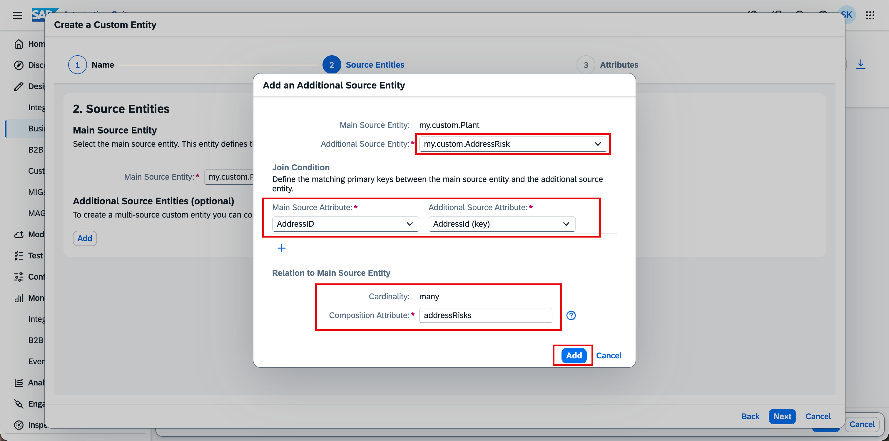

#### Additional Source Entity 2

| Field | Value |
| :--- | :--- |
| Additional Source Entity | **`sap.s4.A_MatlStkInAcctMod`** |
| Main Source Attribute | **`Plant (key)`** |
| Additional Source Attribute | **`Plant (key)`** |
| Cardinality | **`many`** |
| Composition Attribute | **`matlStkInAcctMods`** |

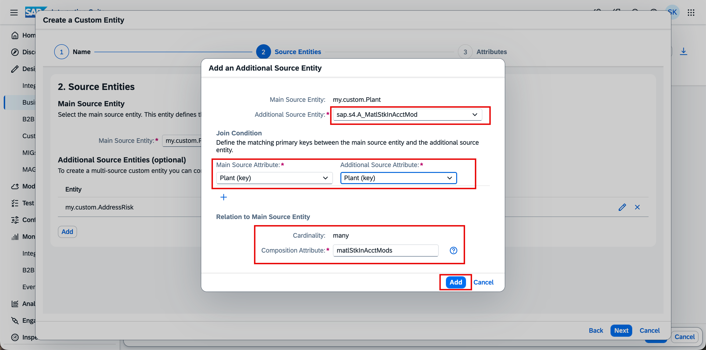

Both additional sources are now listed. Click **Next**.

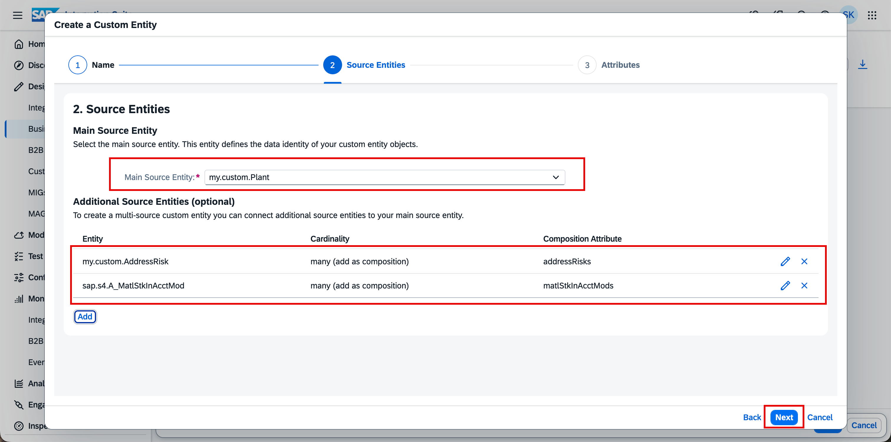

#### Attributes

Select the attributes from each source entity as shown. Use the **Add as** column to rename the attribute in the custom entity schema.

#### my.custom.Plant (Main Source Entity)

| Attribute | Constraint | Data Type | Select | Add as |
| :--- | :--- | :--- | :--- | :--- |
| Plant | key | String(4) | ✓ | `id` |
| PlantName | | String(30) | ✓ | `plantName` |
| ValuationArea | | String(4) | | |
| PlantCustomer | | String(10) | | |
| PlantSupplier | | String(10) | | |
| FactoryCalendar | | String(2) | | |
| DefaultPurchasingOrganization | | String(4) | | |
| SalesOrganization | | String(4) | | |
| AddressID | | String(10) | | |
| PlantCategory | | String(1) | | |
| DistributionChannel | | String(2) | | |
| Division | | String(2) | | |
| Language | | String(2) | | |
| IsMarkedForArchiving | | Boolean | | |

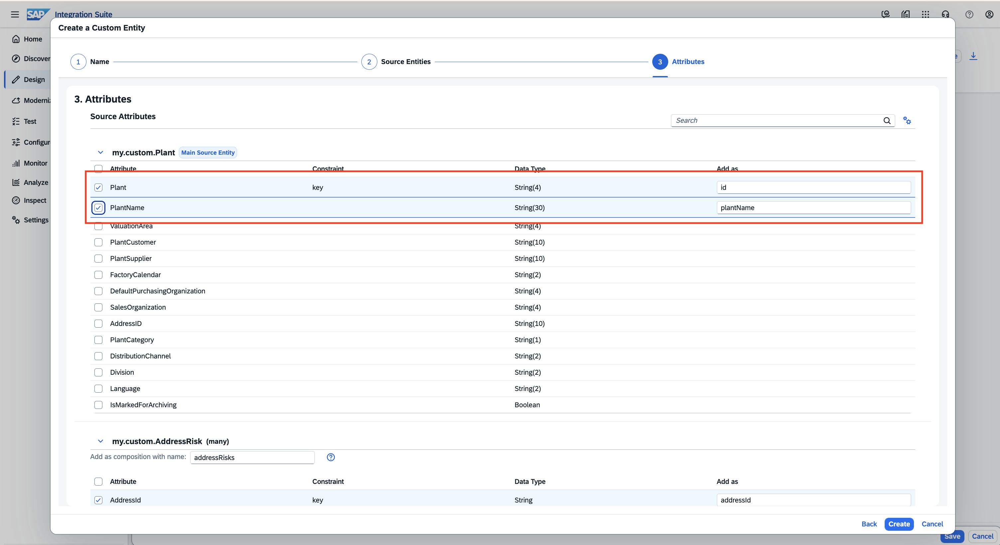

#### my.custom.AddressRisk (many — composition name: addressRisks)

| Attribute | Constraint | Data Type | Select | Add as |
| :--- | :--- | :--- | :--- | :--- |
| AddressId | key | String | ✓ | `addressId` |
| RiskFactor | key | String | ✓ | `riskFactor` |
| RiskCategory | | String | ✓ | `riskCategory` |
| RiskScore | | String | ✓ | `riskScore` |
| RiskTrend | | String | ✓ | `riskTrend` |
| RiskScope | | String | ✓ | `riskScope` |

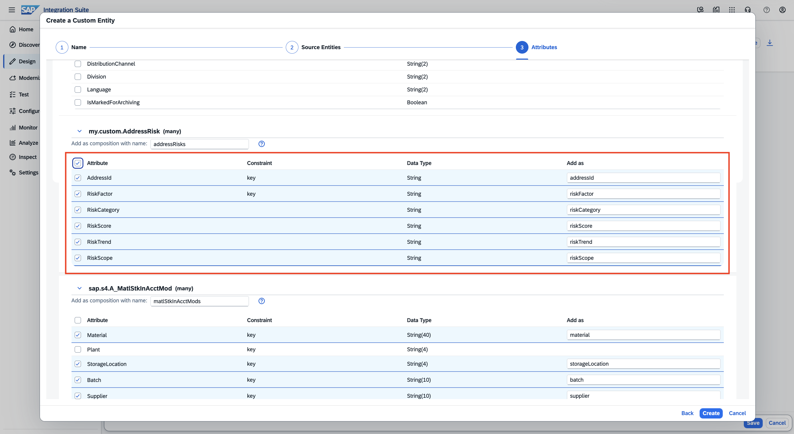

#### sap.s4.A_MatlStkInAcctMod (many — composition name: matlStkInAcctMods)

| Attribute | Constraint | Data Type | Select | Add as |
| :--- | :--- | :--- | :--- | :--- |
| Material | key | String(40) | ✓ | `material` |
| Plant | key | String(4) | | |
| StorageLocation | key | String(4) | ✓ | `storageLocation` |
| Batch | key | String(10) | ✓ | `batch` |
| Supplier | key | String(10) | ✓ | `supplier` |
| Customer | key | String(10) | ✓ | `customer` |
| WBSElementInternalID | key | String(8) | ✓ | `wbsElementInternalID` |
| SDDocument | key | String(10) | ✓ | `sdDocument` |
| SDDocumentItem | key | String(6) | ✓ | `sdDocumentItem` |
| InventorySpecialStockType | key | String(1) | ✓ | `inventorySpecialStockType` |
| InventoryStockType | key | String(2) | ✓ | `inventoryStockType` |
| WBSElementExternalID | | String(24) | | |
| MaterialBaseUnit | | String(3) | | |
| MatlWrhsStkQtyInMatlBaseUnit | | Decimal(14,31) | ✓ | `matlWrhsStkQtyInMatlBaseUnit` |

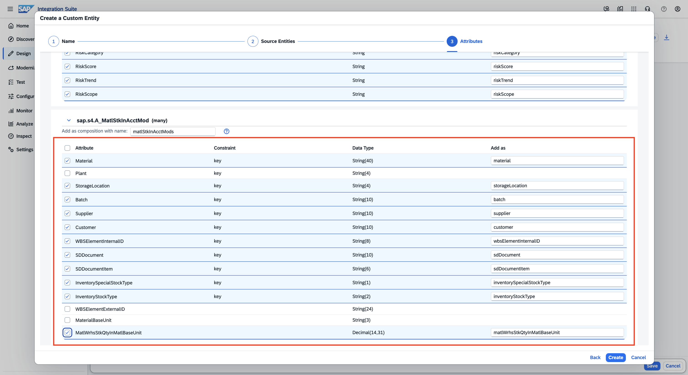

Click **Create**.

> The attributes selected above reflect the fields relevant to the plant supply risk use case. In a real implementation, select attributes based on your own business requirements.

#### Apply and Save

After clicking **Create**, you land on the Custom Entity detail page. Click **Apply** to confirm.

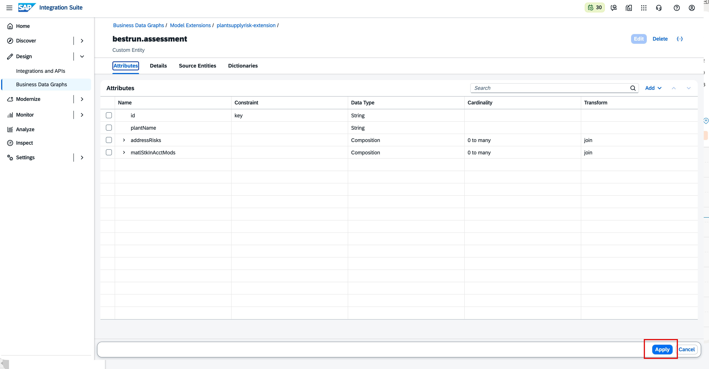

You are returned to the Model Extensions page where `bestrun.assessment` now appears in the **Custom Entities** list. Click **Save**.

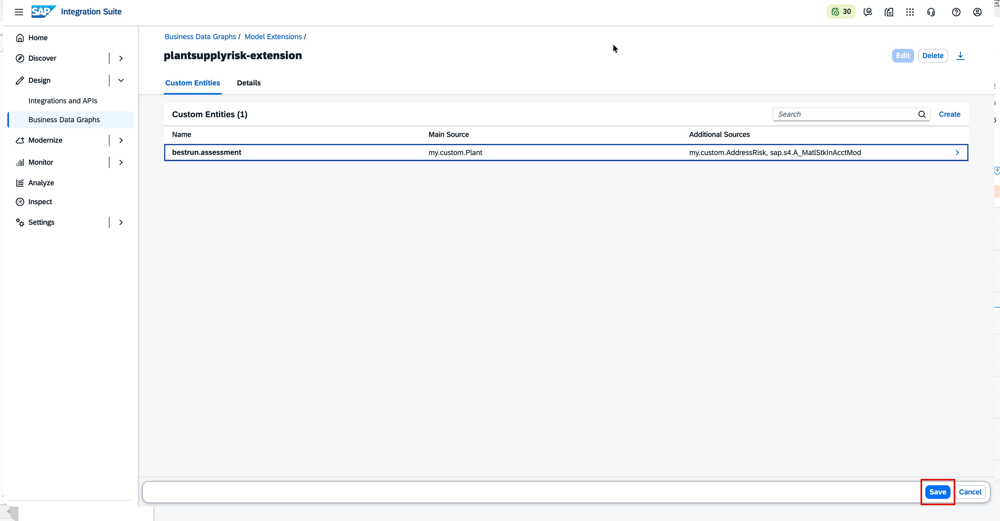

---

### Step 7 — Connect the Model Extension to the Business Data Graph

Navigate to **Design → Business Data Graphs** and open **`plantsupplyrisk`**.

> After opening, the graph status changes to **Draft**. Linking a Model Extension is a configuration change that requires a fresh activation cycle.

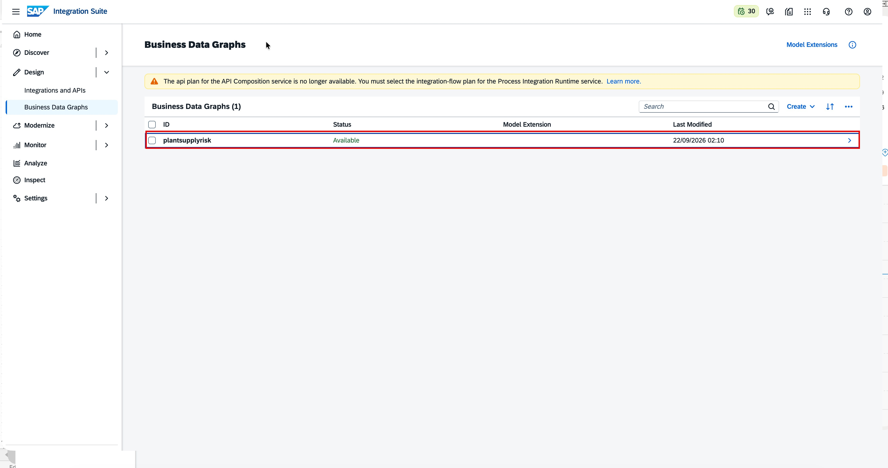

Click the **Model Extensions** tab, then click **Edit** followed by **Add a Model Extension**.

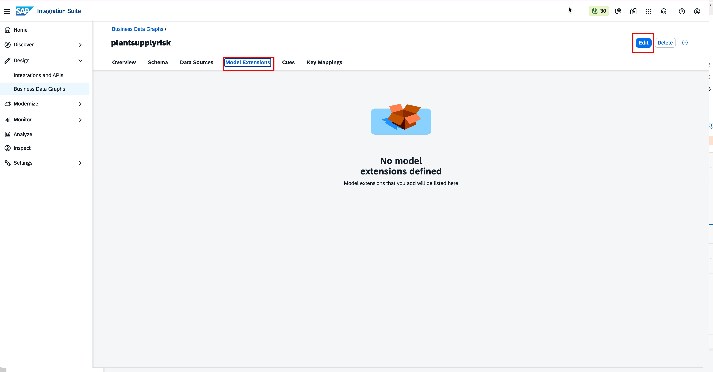

Click on **Add a Model Extension**
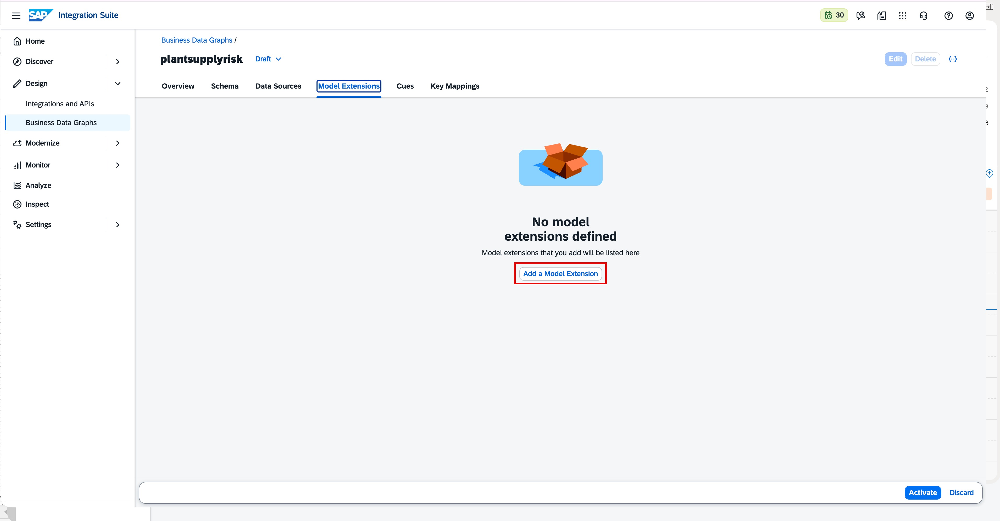


In the **Edit Model Extensions** dialog, select **`plantsupplyrisk`** and click **Apply**.

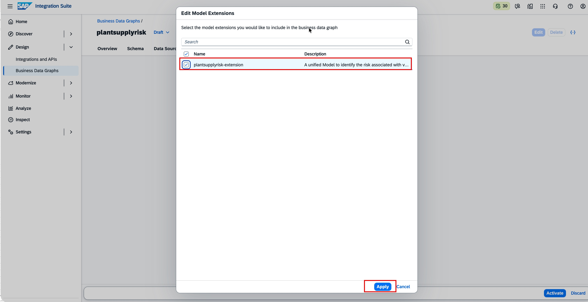


Click **Activate**. 

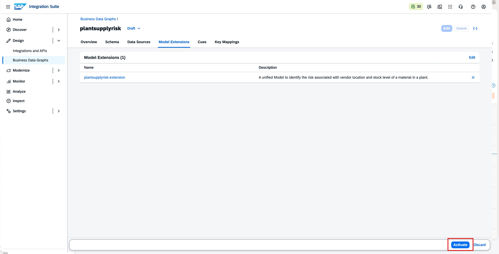

Click on Update
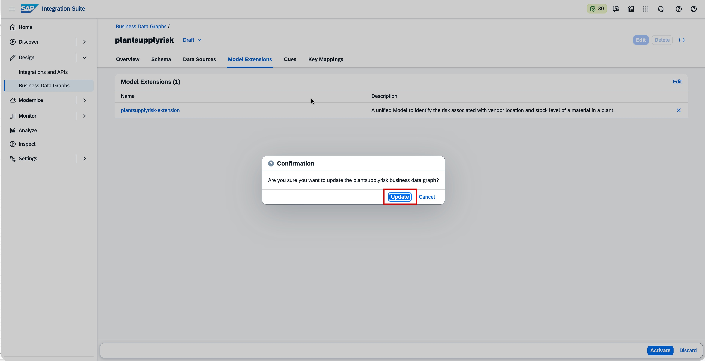


> The status returns to **Available** and the `bestrun` namespace now appears in the Schema.
> Copy the **OData URL** from this page — you will need it when configuring the MCP Server in the next tutorial.

---

### Step 8 — Explore and Test via API Composition Navigator

Click the **grid icon (⠿)** in the top-right and select **API Composition Navigator**.

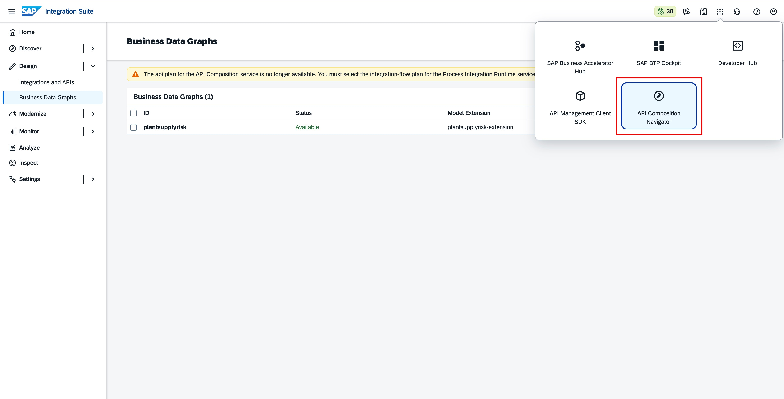

Click on **`plantsupplyrisk`**.

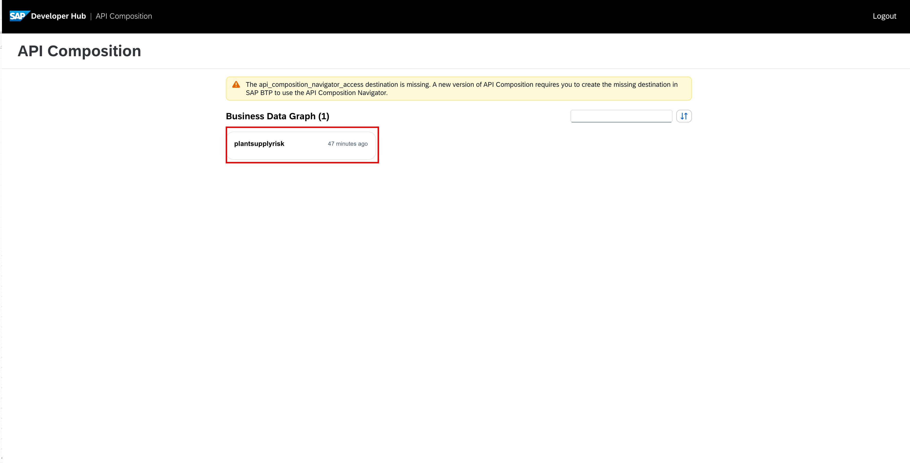

In the left panel, expand the **bestrun (1)** namespace and click **assessment**. The entity overview shows the source entities and connected navigation properties. Click **OpenAPI Specification** to download the spec file — you will need this in the next tutorial.

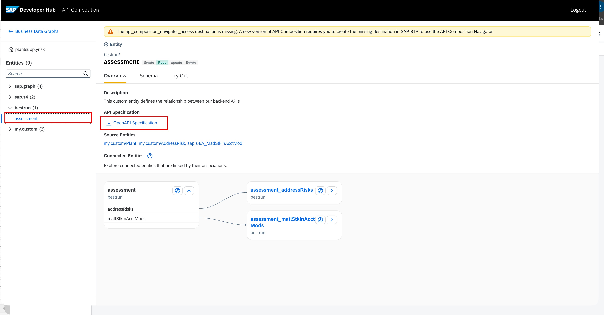

Click the **Try Out** tab. Click **$expand** and check both **`addressRisks`** and **`matlStkInAcctMods`**. The query updates to:

```text
/bestrun/assessment?$top=1&$expand=addressRisks,matlStkInAcctMods
```

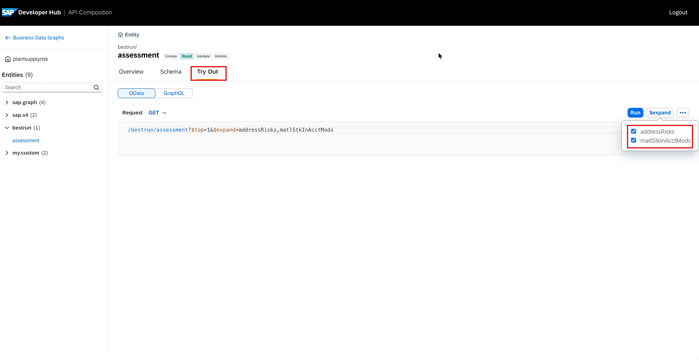

Click **Run**.
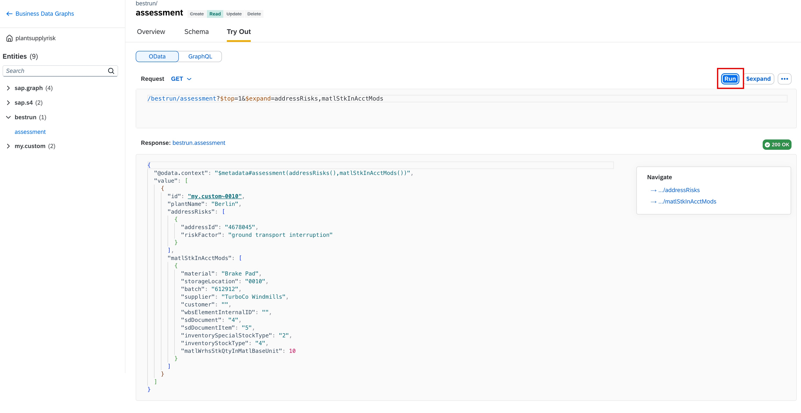

The response returns a `200 OK` with a live plant record showing the composed structure — plant details, expanded address risks with `riskScope`, and material stock records with `matlWrhsStkQtyInMatlBaseUnit`:

```json
{
  "@odata.context": "$metadata#assessment(addressRisks(),matlStkInAcctMods())",
  "value": [
    {
      "id": "my.custom~0010",
      "plantName": "Berlin",
      "addressRisks": [
        {
          "addressId": "4678045",
          "riskFactor": "ground transport interruption",
          "riskCategory": "low",
          "riskScore": "0.1",
          "riskTrend": "increasing",
          "riskScope": "local"
        }
      ],
      "matlStkInAcctMods": [
        {
          "material": "Brake Pad",
          "storageLocation": "0010",
          "batch": "612912",
          "supplier": "Windmill Components",
          "customer": "",
          "wbsElementInternalID": "",
          "sdDocument": "4",
          "sdDocumentItem": "5",
          "inventorySpecialStockType": "2",
          "inventoryStockType": "4",
          "matlWrhsStkQtyInMatlBaseUnit": 10
        }
      ]
    }
  ]
}
```


You have successfully built a unified supply risk API. The OData URL and OpenAPI Specification from this tutorial are the inputs for [Create an MCP Server for Enterprise AI Agents](../integration-suite-mcp-server/integration-suite-mcp-server.md).
