# Create an MCP Server for Enterprise AI Agents

<!-- description --> Wrap a composed Business Data Graph as an MCP Server in SAP Integration Suite, publish it via the Developer Hub, and test its tools with the MCP Inspector.
The tools exposed by MCP server helps select the most reliable supplier for each material taking into consideration the risk associated with a location of the plant, stock levels of the material at a plant and physical distance of the plant from delivery location.

## Prerequisites

- You have completed [Build a Supply Risk API with API Composition](./api-composition-supply-risk) and have the **OData URL** and downloaded **OpenAPI Specification** from Step 8 of that tutorial
- **SAP Integration Suite** with **API Management** capability activated
- An **Integration Cell** runtime is activated and available — refer to [API-Centric Integration on SAP Integration Suite — Part 1](https://community.sap.com/t5/technology-blog-posts-by-sap/api-centric-integration-on-sap-integration-suite-part-1-build-and-deploy/ba-p/14438357) (section: **Activate the Integration Cell Runtime**) if needed
- The MCP Server artifact is available only on the **Enhanced**, **Premium**, **Trial**, and **Free Tier** service plans for SAP Integration Suite
- The `PI_Integration_Developer` role collection is assigned to your user
- [Assign roles to your user for Cloud Integration and API Management Capabilities](https://help.sap.com/docs/integration-suite/sap-integration-suite/configuring-user-access?locale=en-US&state=PRODUCTION&version=CLOUD#loio2c6214a3228e4b4cba207f49fda92ed4__section_xbf_glz_l2c)
- [Check BTP regions where the Integration Cell runtime is available](https://me.sap.com/notes/3769634)

## You will learn

- How to create an Integration Package and add an MCP Server backed by an OpenAPI Specification
- How the default policy model secures the MCP Server with authentication and authorization
- How to deploy the MCP Server to an Integration Cell runtime
- How to publish the MCP Server as a product in the Developer Hub, subscribe, and retrieve OAuth credentials
- How to connect and test the MCP tools using the MCP Inspector

---

### Step 1 — Create an Integration Package

In SAP Integration Suite, go to **Design → Integrations and APIs**.

You will see a list of existing Integration Packages on the tenant.

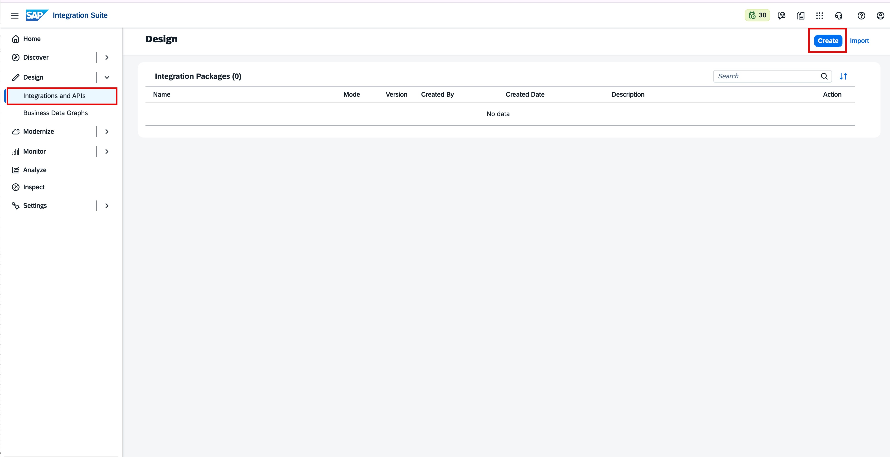

Click **Create** and fill in the package details:

| Field | Value |
| :--- | :--- |
| Name | `plant-supply-risk-package` |
| Technical Name | *(auto-populated)* |
| Short Description | `This package is created to create MCP artifacts using the OpenAPI specification & API composed URL from the plant supply risk graph.` |
| Version | `1.0` |

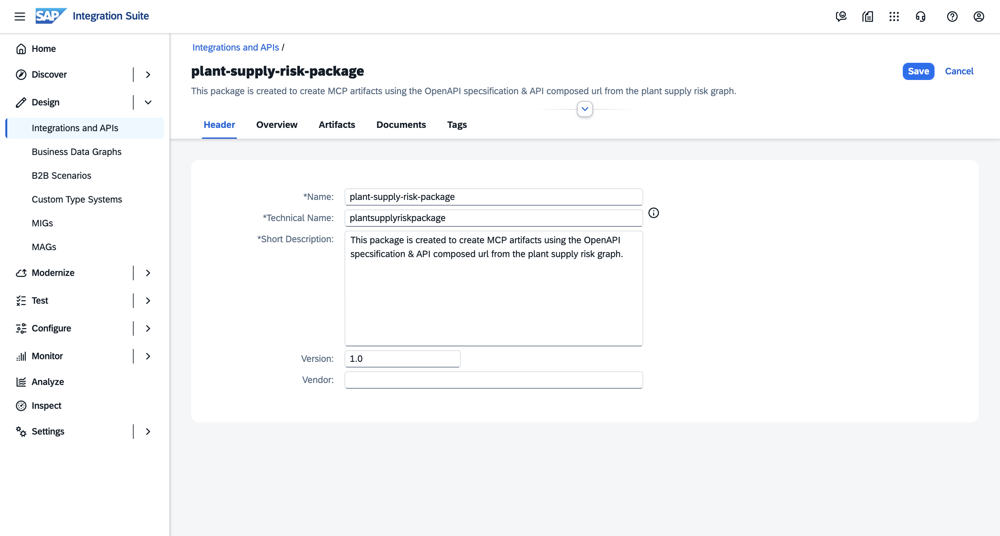

Click **Save**.

---

### Step 2 — Add an MCP Server

After saving, you land on the package detail page. Click the **Artifacts** tab, then click **Add → MCP Server**.

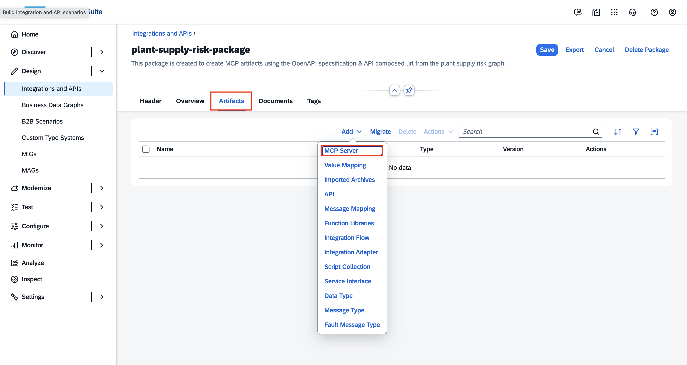

#### Select Source Type

In the **Add MCP Server** wizard, select **HTTP Endpoint with OpenAPI Specification**.

> This option creates an MCP Server from any HTTP endpoint by providing the URL and importing the OpenAPI Specification.

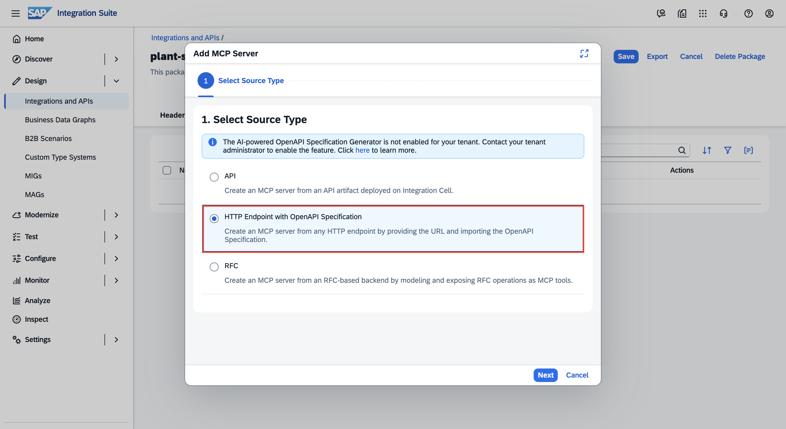

Click **Next**.

#### Configure MCP Server Details

Fill in the MCP Server details:

| Field | Value |
| :--- | :--- |
| Method | `Upload` |
| File Name | Upload the **OpenAPI Specification** downloaded from the API Composition Navigator in Step 8 of the previous tutorial |
| Source | `URL` |
| URL | The **OData URL** copied from the Business Data Graph Overview in Step 7 of the previous tutorial |
| Name | `plantSupplyRisk` |
| ID | `plantSupplyRisk` |
| MCP Path | `/plantsupplyrisk` |
| Version | `1.0` |

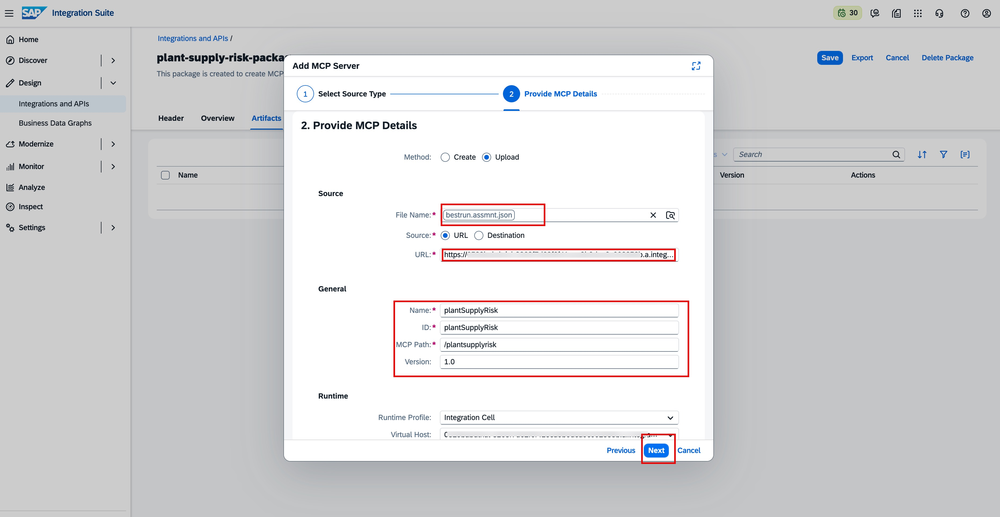

Click **Next**.

#### Select Tools

The wizard reads your OpenAPI Specification and lists all available operations as **tools**. Select the tools to expose to the AI agent:

| Method | Path | Description | Select |
| :--- | :--- | :--- | :--- |
| GET | `/bestrun/assessment` | Retrieve a list of assessments | ✓ |
| GET | `/bestrun/assessment/{id}` | Retrieve a single assessment | ✓ |
| GET | `/bestrun/assessment/{id}/addressRisks` | Retrieve a list of address risks | ✓ |
| GET | `/bestrun/assessment/{id}/addressRisks/{addressId}...` | Retrieve a single address risk | ✓ |
| GET | `/bestrun/assessment/{id}/matlStkInAcctMods` | Retrieve a list of material stock records | |
| GET | `/bestrun/assessment/{id}/matlStkInAcctMods/{mat}...` | Retrieve a single material stock record | |

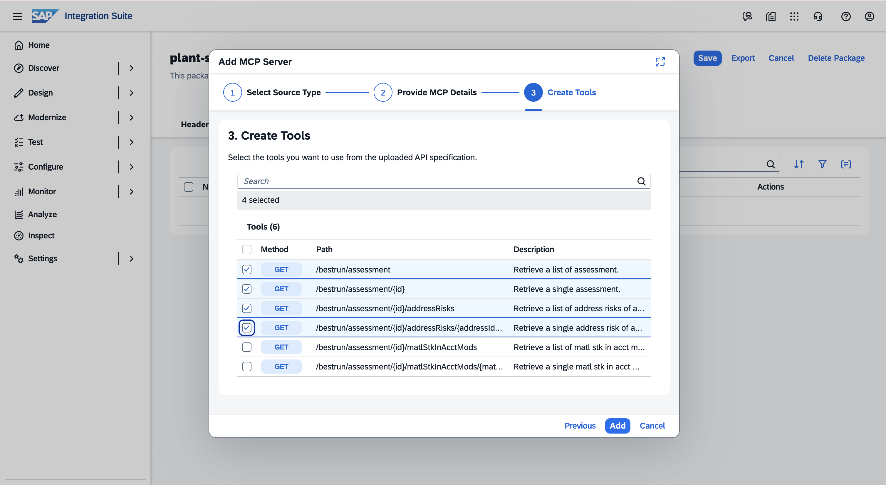

Click **Add**.

> The four tools above expose the assessment and address risk operations — the operations most relevant to the supply risk use case. Select tools based on what the AI agent actually needs to answer business questions.

---

### Step 3 — Review the Policy Model

From the MCP Server detail page, click the **Policies** tab.

When an MCP Server is created, SAP Integration Suite automatically applies a default processing template with the following components:

| Component | Role |
| :--- | :--- |
| **MCP Sender Adapter** | Entry point — exposes the managed MCP endpoint and receives requests from AI agents |
| **Authentication** | Verifies the identity of the API consumer. Supports Basic Authentication, OAuth 2.0, Client Certificate, and External OAuth (OIDC) for token validation from external identity providers such as Microsoft Entra ID, Google, and Okta. Multiple methods can be enabled simultaneously. |
| **Authorization** | Determines whether the authenticated caller is permitted to invoke the API |
| **HTTP Receiver Adapter** | Forwards the request to the backend service and returns the response through the same pipeline |

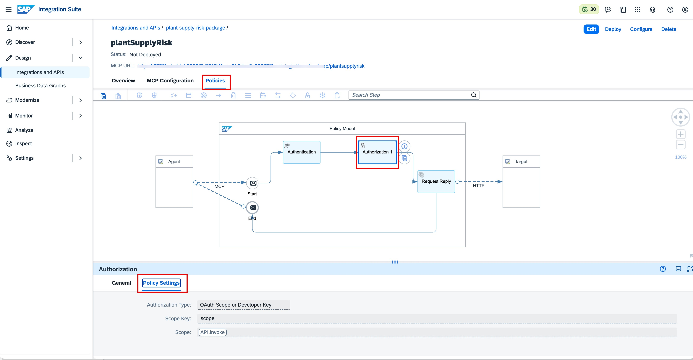

#### Authorization Settings

Click the **Authorization 1** policy in the diagram. The **Policy Settings** tab shows:

| Setting | Value |
| :--- | :--- |
| Authorization Type | `OAuth Scope or Developer Key` |
| Scope Key | `scope` |
| Scope | `API.invoke` |

Access is granted if the caller presents either a valid OAuth scope (`API.invoke`) **or** a valid Developer Key. Other available modes include requiring both, OAuth scope only, or Developer Key only.

#### Extending the Policy Flow

Beyond the defaults, additional policies can be added:

- **Security** — Request validation, threat protection, certificate pinning
- **Traffic Management** — Quota limits and Spike Arrest to protect backend systems from overload
- **Transformation & Mediation** — Payload modification, format conversion, JavaScript or Python scripts

Return to the **Overview** tab and proceed to deployment.

---

### Step 4 — Deploy the MCP Server

From the MCP Server detail page, click **Deploy** in the top-right.

A confirmation dialog will appear:

| Field | Value |
| :--- | :--- |
| Runtime Profile | `Integration Cell` |
| Virtual Host | *(auto-populated based on your tenant)* |

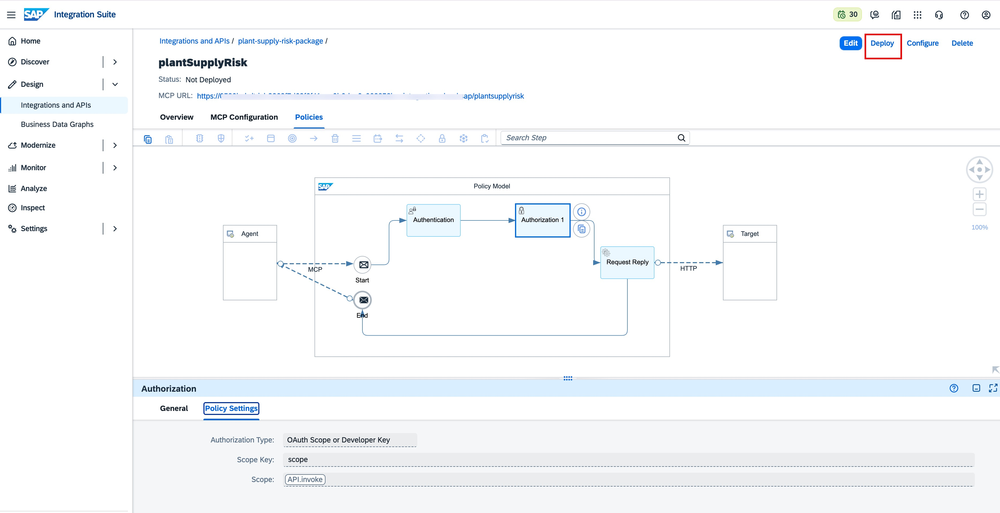

Click **Yes** to confirm.
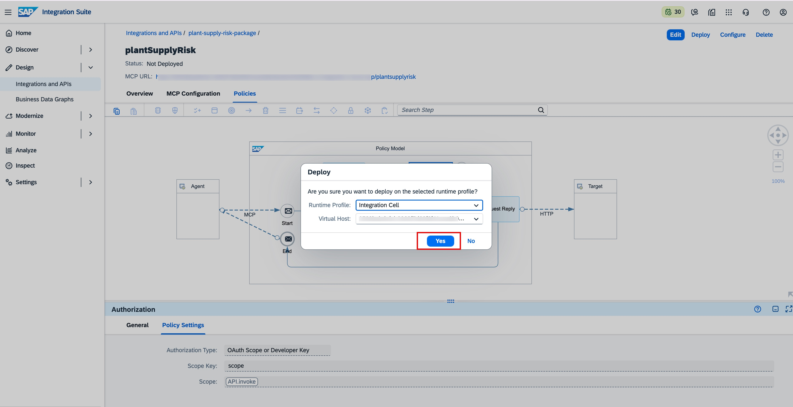

> Note the **MCP URL** shown on this page — it follows the pattern `https://<virtual-host>/plantsupplyrisk`. You will need this URL when connecting the MCP Inspector in Step 8.

---

### Step 5 — Publish via Developer Hub

From the MCP Server detail page, click the **grid icon (⠿)** in the top-right navigation bar, then click **Developer Hub**.

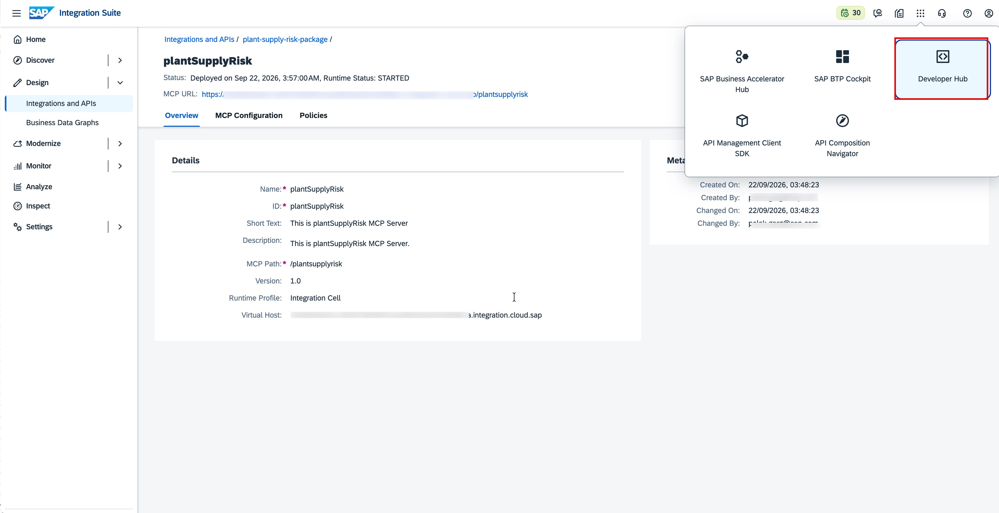

In the Developer Hub top navigation bar, click **Admin Center → Content**.

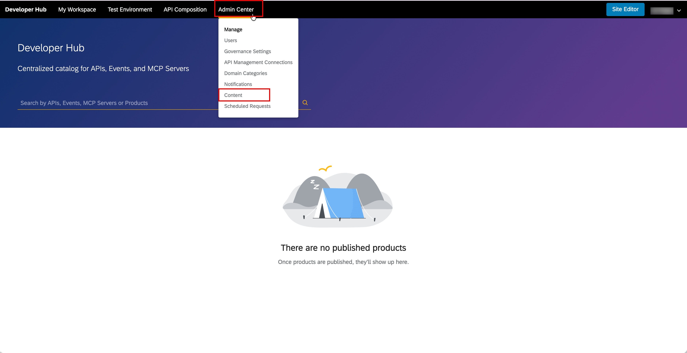

On the **Manage Content** page, open the **Business Systems** tab and click on your Integration Suite business system.

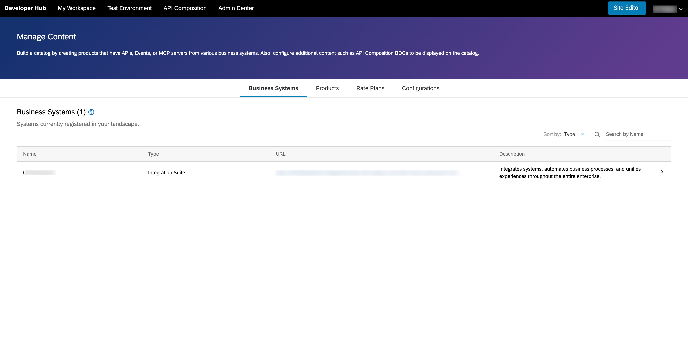

Click the **MCP Servers** tab. Select **`plantSupplyRisk`** by checking the checkbox next to it.

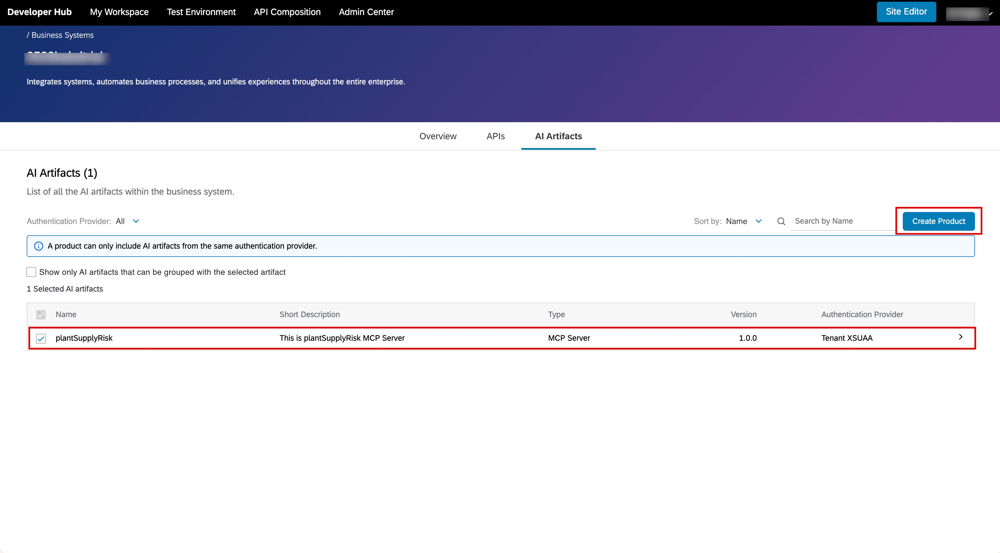

Click **Create Product** and fill in the product details:

| Field | Value |
| :--- | :--- |
| Name | `PlantSupplyRisk` |
| ID | `PlantSupplyRisk` |
| Short Text | *(optional)* |
| Description | `Get real-time visibility into plant supply risks and potential disruptions across the supply chain` |

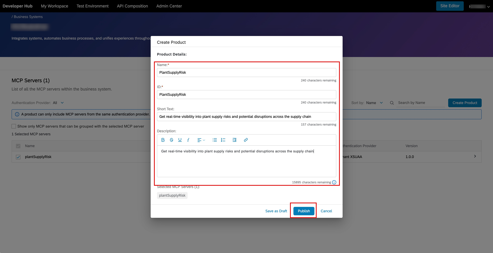

Click **Publish**.

> Publishing triggers an AI-assisted content creation process in the background. You can optionally monitor its progress via **Admin Center → Scheduled Requests**. Wait for the status to change to **Success** before subscribing.

Navigate to the **Developer Hub** home page. Your product `plantSupplyRisk` should appear in the catalog.

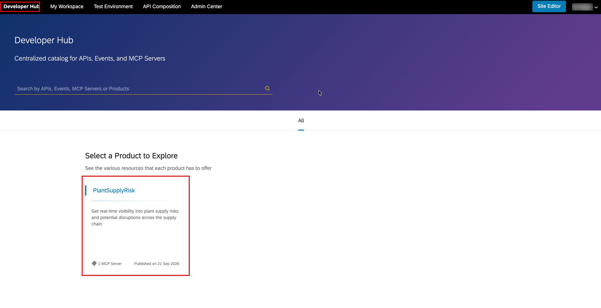

---

### Step 6 — Subscribe to the Product

Click on **`PlantSupplyRisk`** from the Developer Hub catalog.

On the product detail page, click **Subscribe → Create New Subscription for Agent**.

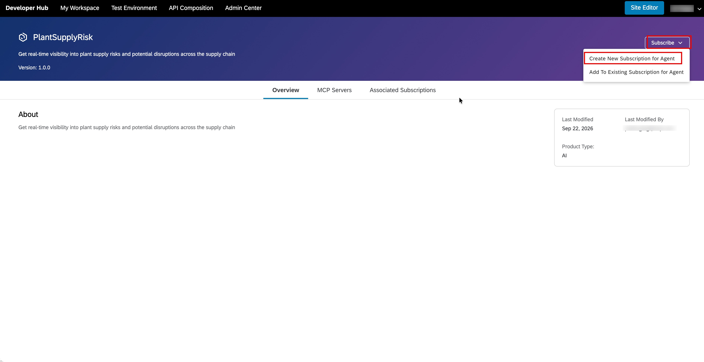

Fill in the subscription details:

| Field | Value |
| :--- | :--- |
| Product | `Plant Supply Risk Agent` *(pre-filled)* |
| Name | `Plant Supply Risk Agent` |
| Short Text | *(optional)* |
| Description | `Select most reliable supplier for each material and location taking into consideration the risk and physical distance`|

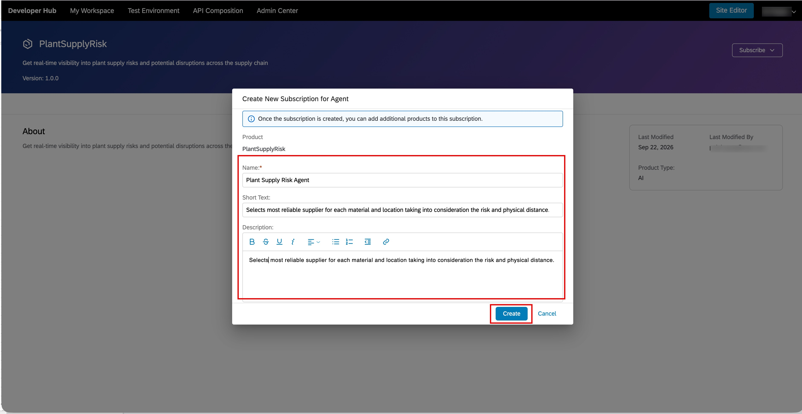

Click **Create**.

> It may take a couple of minutes for the subscription to be finalized and for credentials to become available. Proceed to Step 7 once the subscription appears in **My Workspace → Subscriptions → Agents**.

---

### Step 7 — Retrieve Credentials

In the Developer Hub top navigation bar, click **My Workspace**.

On the **Subscriptions** page, click the **Agents** tab. Click on **`Plant Supply Risk Agent`** to open it.

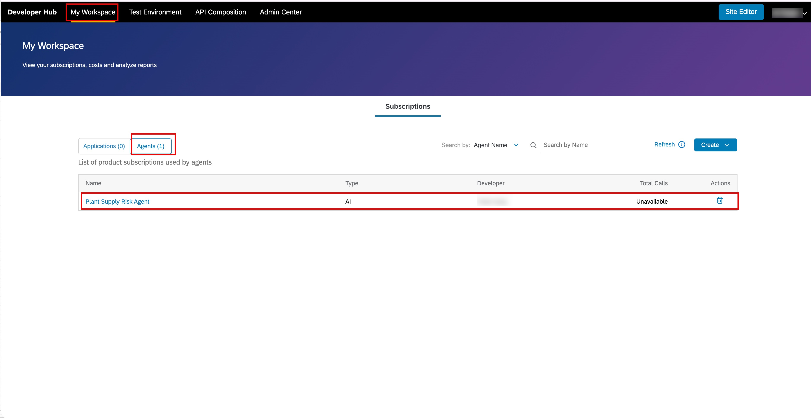

On the subscription **Overview** page, locate the **Credentials** section. Copy and save the following — you will need all three in Step 8:

| Credential | What it is |
| :--- | :--- |
| **Token URL** | OAuth token endpoint to exchange your credentials for a bearer token |
| **Key** | OAuth Client ID |
| **Secret** | OAuth Client Secret |

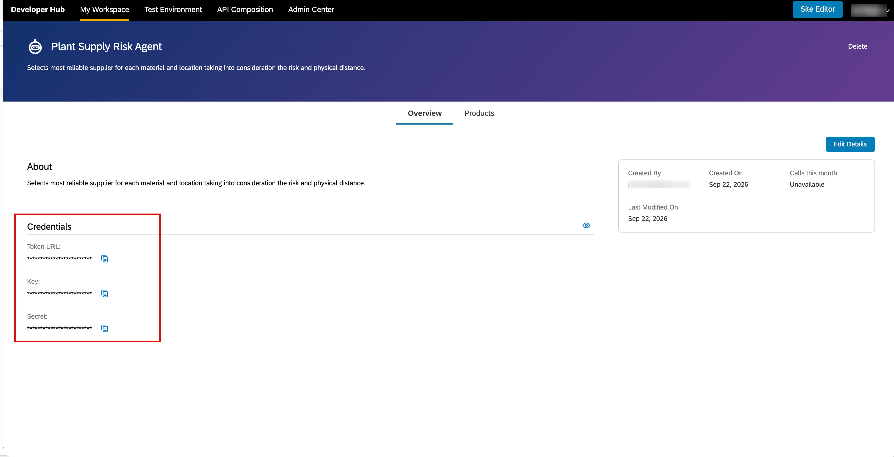

---

### Step 8 — Test with MCP Inspector

The MCP Server can be consumed by any MCP-compatible agent. For this workshop, your instructor will provide a hosted **MCP Inspector** URL — open it in your browser.

 #### Add Your MCP Server

Click **Add Servers → + Add manually**.

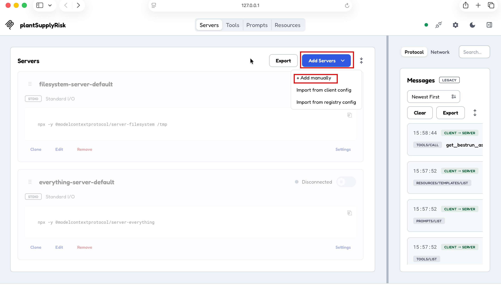

In the **Add server** dialog, fill in:

| Field | Value |
|---|---|
| Server ID | `plantsupplyrisk-mcp-XX` |
| Transport | `streamable-http` |
| URL | Your MCP URL from Ex. 2.4 (e.g. `https://<virtual-host>/mcp-plantsupplyrisk-XX`) |

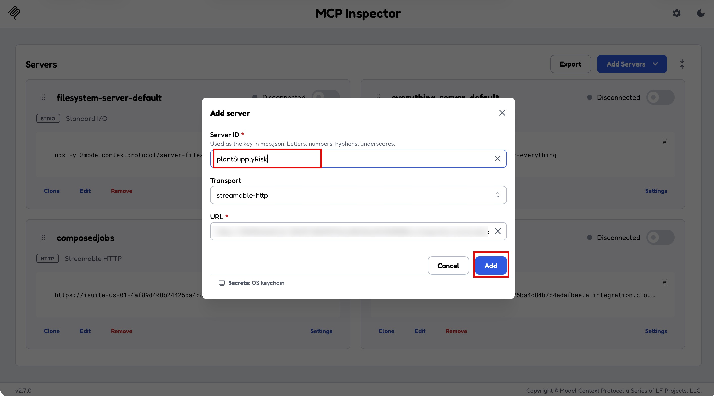

Click **Add**.

#### Get a Bearer Token

SAP Integration Suite uses OAuth 2.0 Client Credentials. Use any API client (Bruno, Postman, curl, etc.) to request a token.

Make a `POST` request with **Form URL Encoded** body:

| Field | Value |
|---|---|
| URL | Your **Token URL** from Ex. 2.7 |
| `grant_type` | `client_credentials` |
| `client_id` | Your **Key** from Ex. 2.7 |
| `client_secret` | Your **Secret** from Ex. 2.7 |

A `200 OK` response returns an `access_token`. Copy it.

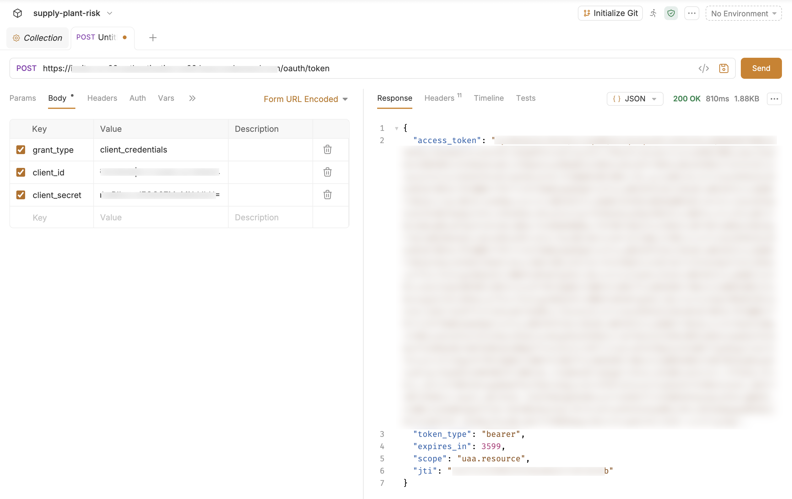

#### Configure Authentication

On the server card, click **Settings**.

Scroll to **Custom Headers** and click to expand the section. Click **+ Add Header** and enter:

| Key | Value |
|---|---|
| `Authorization` | `Bearer <paste your access_token here>` |

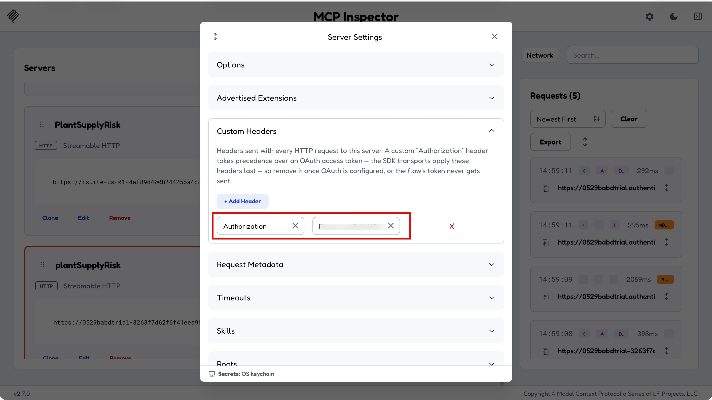

Scroll down to **OAuth Settings**. Ensure **Enterprise-managed authorization** is **unchecked**.

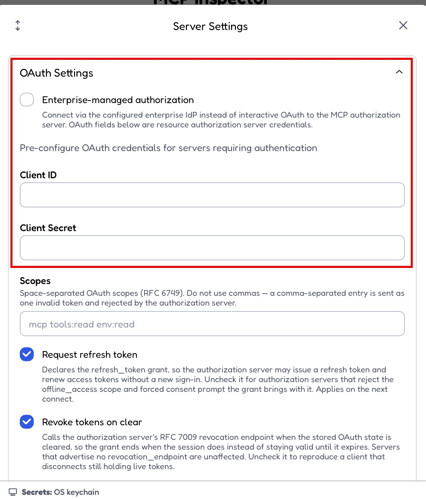

Close Settings.

#### Connect and Explore Tools

Toggle the server switch to **Connected**. The server card turns green confirming a successful connection.

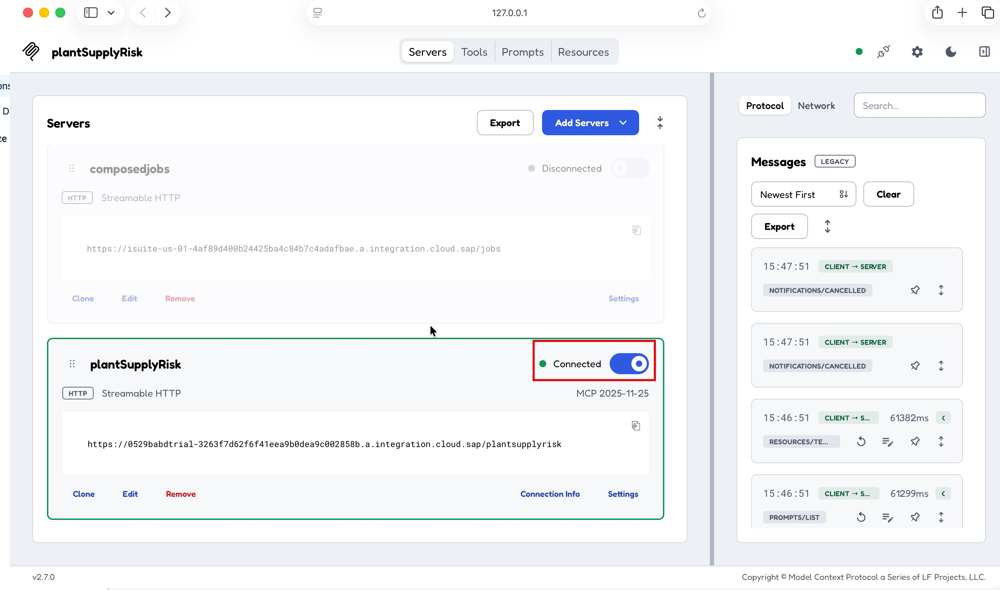

In the top navigation bar, click **Tools**. You will see the 4 operations exposed from your OpenAPI spec. Click **Retrieve a list of assessment** (`get_bestrun_assessment`) — the parameter form opens in the center pane. No parameters are required — click **Execute Tool**.

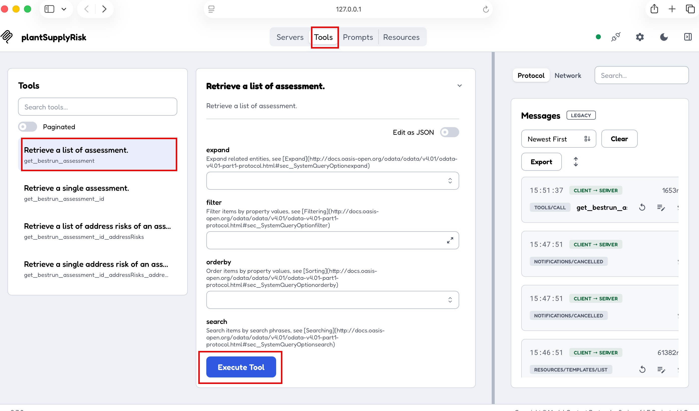

The Results pane shows all plants with their IDs (Berlin, Munich, London, etc.).

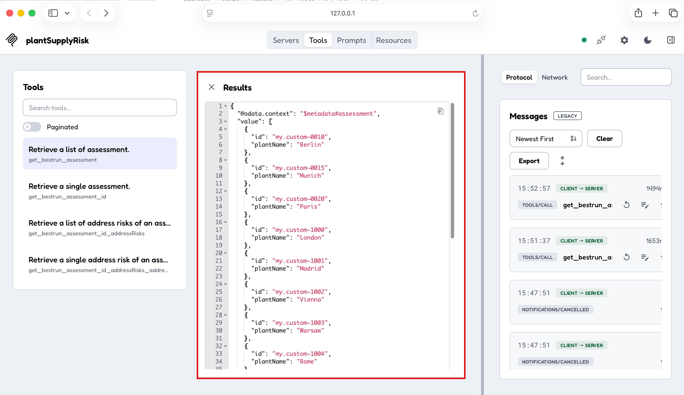

Pick any `id` from the results and click **Retrieve a list of address risks of an assessment** (`get_bestrun_assessment_id_addressRisks`). Enter the `id` value in the **id** field.

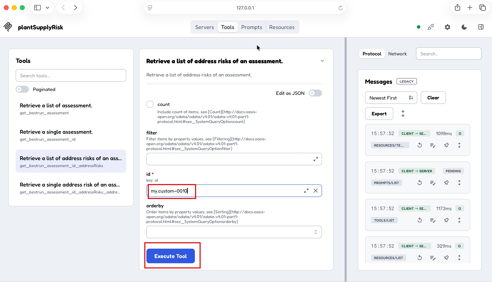

Click **Execute Tool** — this returns the live risk scores for that plant's location.

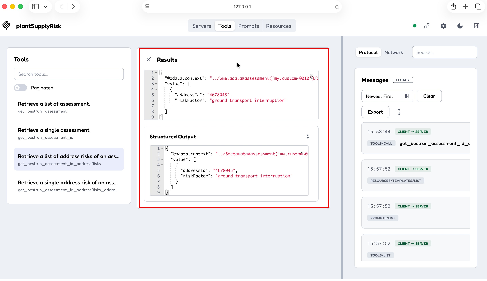

> **Tip:** The data you see here — plant IDs, risk factors, risk scores — is exactly what an AI agent will receive when it calls these tools autonomously to answer a procurement question.

#### Troubleshooting

| Issue | Fix |
|---|---|
| Cannot connect | Verify the MCP URL matches the one shown in Ex. 2.4 |
| 401 Unauthorized | Re-generate a fresh token — tokens expire after ~3600 seconds |
| No tools listed | Ensure the correct tools were selected during Ex. 2.2 Step 4 |
| Issuer mismatch error | Do not use Enterprise-managed authorization — use Custom Headers with Bearer token instead |

